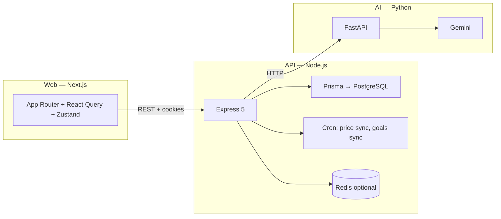

<div align="center">

# WealthWise · WealthPortal

**India-first personal wealth management — portfolio tracking, goal-based planning, and an AI advisor that speaks your context.**

[](README.md)
[](https://nextjs.org/)
[](https://expressjs.com/)
[](https://fastapi.tiangolo.com/)
[](https://www.prisma.io/)

*Minor project · full-stack web application*

[What it does](#what-it-does) · [USP](#why-this-project-stands-out-usp) · [Features](#features-at-a-glance) · [Architecture](#architecture) · [Repository layout](#repository-layout) · [Run locally](#running-locally)

</div>

---

## What it does

**WealthWise** (frontend product name) / **WealthPortal** (repository) is a **full-stack wealth-management platform** tailored for Indian investors. Users sign in securely, track holdings across **equities, mutual funds, fixed income, gold, and more**, set **financial goals** with health tracking, manage **family-linked portfolios**, and interact with an **AI advisor** powered by **Google Gemini** — including conversational guidance, automated **nudges** (rebalancing, concentration risk, SIP insights), a **portfolio health** lens, and **CIBIL report parsing** through the Python AI service.

The experience is delivered as a **modern, glass-style dashboard** (sidebar navigation, dark/light themes, Framer Motion polish) backed by a **REST API** with JWT sessions, validation, and optional **Redis** + **background jobs** for market sync.

---

## Why this project stands out (USP)

| USP | In one line |
|-----|-------------|
| **India-focused instruments** | First-class support for MF, FD/RD, PPF, EPF, NPS, SGB, gold, and Indian broker flows — not just “generic stocks.” |
| **AI with real portfolio context** | Chat and nudges are fed **your** holdings, goals, risk profile, and recent bill-pay checklist — not generic finance trivia. |
| **Goal + holding linkage** | Goals track **health status**, suggested SIPs, and optional **allocations** tied to specific holdings. |
| **Household view** | **Family members** can each have a **portfolio** — useful for spouses, kids’ education funds, etc. |
| **Ops-ready backend** | Rate limits, Helmet, Zod validation, Prisma ORM, cron **price sync** (Yahoo Finance), optional Redis, report/notification models. |

---

## Features at a glance

### Core product

- **Authentication** — Email/password, **Google OAuth**, JWT access + refresh (**httpOnly cookies**), silent refresh on `401`, optional **2FA (TOTP)**.
- **Dashboard** — Aggregated view of wealth and activity (driven by dedicated dashboard services).
- **Portfolio & holdings** — Add/edit holdings across **asset classes**; broker sources include **manual**, **Zerodha**, **Upstox**, **CSV import**; P&amp;L, **XIRR**, and live/derived pricing via market integration and **scheduled sync jobs**.
- **Goals** — Categories (retirement, house, education, travel, emergency, wedding, custom); **target date & amount**, progress, **health** (on track / at risk / off track), SIP hints, link holdings to goals.
- **Family** — Manage **family members** (relationship, minors, allowance) and **per-member portfolios**.
- **Reminders & bills** — **Checklist templates** (rent, utilities, EMIs, subscriptions, insurance, etc.) with **monthly entries** and paid/unpaid tracking — also surfaces in **AI context** for smarter advice.
- **Learn** — Curated learning flows by category (API-backed).
- **Reports** — Generate **portfolio**, **capital gains**, **full financial**, or **family** reports (queued → ready pipeline in the data model).
- **Settings & onboarding** — Risk profile, preferences, guided onboarding flow.

### AI layer

- **Chat sessions** — Persistent **chat history** per user; messages stored in PostgreSQL.
- **Nudges** — Types such as **rebalance**, **expense ratio**, **concentration**, **SIP underperform**, **panic sell**, **health report**; severity levels.
- **Micro-routes (FastAPI)** — e.g. **health score**, **CIBIL PDF parsing** (pdfplumber + Gemini stack in `ai-service`).

---

## Architecture

High-level flow: the **Next.js** app talks to the **Express API** (same-origin cookies). The API owns **auth, CRUD, calculations, and jobs**; it calls the **FastAPI + Gemini** service for language and document tasks. **PostgreSQL** holds authoritative data; **Redis** is available for caching/queues where configured.



---

## Repository layout

```
Wealth-Portal/
├── web/                    # Next.js 16 · App Router · Tailwind CSS 4 · TypeScript
│   ├── src/
│   │   ├── app/
│   │   │   ├── (auth)/     # login, register, verify, onboarding
│   │   │   └── (portal)/   # dashboard, portfolio, goals, advisor, family,
│   │   │                    # learn, reminders, reports, settings (+ dynamic routes)
│   │   ├── components/     # UI, shared widgets (e.g. Symbol combobox, modals)
│   │   ├── lib/            # api-client (axios + refresh), utilities
│   │   ├── providers/      # React Query, theme
│   │   └── store/          # auth (Zustand)
│   └── public/
├── server/                 # Express 5 · Prisma · TypeScript
│   ├── prisma/
│   │   └── schema.prisma   # Users, portfolios, holdings, goals, family,
│   │                        # transactions, checklist, AI nudges, chat, reports,
│   │                        # notifications, …
│   └── src/
│       ├── controllers/
│       ├── routes/         # auth, market, holdings, portfolio, goals,
│       │                    # dashboard, family, ai, learn, settings, reminders
│       ├── services/         # domain logic (holdings, goals, market, dashboard, …)
│       ├── middleware/       # auth, validate (Zod), rate limit
│       ├── jobs/             # e.g. priceSync
│       └── lib/              # prisma, redis, calculations
├── ai-service/             # FastAPI · Gemini · CIBIL parsing, chat, nudges, health
│   └── app/
│       ├── routers/        # chat, nudges, health_score, parse_cibil
│       └── gemini_client.py
└── shared/                 # Shared TS types (package stub / future extraction)
```

### Frontend route map (mental model)

| Area | Routes (examples) |
|------|---------------------|
| **Auth** | `/login`, `/register`, `/verify`, `/onboarding` |
| **App shell** | `(portal)` layout: sidebar **Dashboard, Portfolio, Goals, AI Advisor, Family, Learn, Reminders, Reports** + **Settings** |
| **Deep links** | `/portfolio/add`, `/portfolio/[holdingId]`, `/goals/new`, `/goals/[goalId]`, `/family/[memberId]`, `/learn/[category]`, `/advisor/nudges` |

---

## Tech stack

| Layer | Technologies |
|-------|----------------|
| **Frontend** | Next.js 16, React 19, TypeScript, Tailwind CSS 4, Framer Motion, Recharts, Lucide, React Hook Form + Zod, TanStack Query, Zustand, next-themes |
| **Backend** | Node.js, Express 5, Prisma 5, PostgreSQL, Zod, JWT (access/refresh), bcrypt, Bull-ready stack (Bull in deps), ioredis, Yahoo Finance (`yahoo-finance2`), node-cron, multer, Nodemailer, Speakeasy (2FA), Helmet, rate limiting |
| **AI** | Python, FastAPI, `google-generativeai`, pdfplumber, httpx |
| **Infra concepts** | Supabase-compatible Postgres URLs, optional Redis, deploy-friendly CORS (e.g. Vercel / Render) |

---

## Running locally

Prerequisites: **Node.js**, **Python 3**, **PostgreSQL** (e.g. Supabase), and optionally **Redis**.

1. **Database** — Create a database and set `DATABASE_URL` / `DIRECT_URL` in `server` (see Prisma).
2. **Server** — In `server/`: `npm install`, `npx prisma migrate dev` (or `db push`), set `JWT_SECRET`, `JWT_REFRESH_SECRET`, then `npm run dev` (default port **5000**).
3. **Web** — In `web/`: `npm install`, set `NEXT_PUBLIC_API_URL` to your API base (e.g. `http://localhost:5000`), then `npm run dev` (default **3000**).
4. **AI service** — In `ai-service/`: create a virtualenv, `pip install -r requirements.txt`, configure Gemini/API keys in `.env`, run Uvicorn per your setup; point the server’s **`AI_SERVICE_URL`** to it (default **`http://localhost:8000`**).

Health checks: **`GET /health`** on the API and **`GET /health`** on the AI service confirm services are up.

> Environment variables are intentionally **not** committed — copy patterns from each subfolder’s needs (`JWT_*`, `DATABASE_URL`, `REDIS_URL`, `AI_SERVICE_URL`, `ALLOWED_ORIGINS`, Google OAuth secrets, etc.).

---

## Project status & notes

- The **root `web/src/app/page.tsx`** route may still show the default Next.js starter; the **product UI** lives under **`(auth)`** and **`(portal)`** — start from **`/login`** after the API is running.
- **Price sync** can be toggled with **`DISABLE_PRICE_SYNC=true`** when developing offline.

---

<div align="center">

**WealthWise** — *plan smarter, invest clearer, learn as you grow.*

Made with care for a college minor / capstone-style full-stack submission.

</div>
