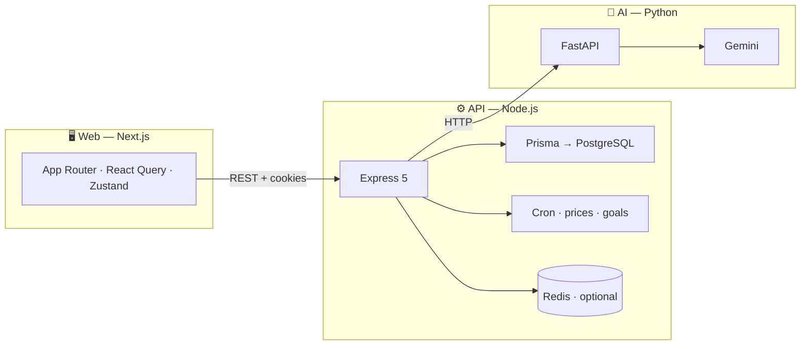

<div align="center">

<!-- Banner-style badge row — tweak hex colors to match your brand -->


<br/>

[](README.md)
[](README.md)
[](https://ai.google.dev/)
[](https://www.typescriptlang.org/)
[](README.md)

<p align="center">
  <strong>Portfolio tracking · Goal-based planning · AI advisor that knows <em>your</em> context</strong>
</p>

<p align="center">
  <a href="#what-it-does"></a>
  <a href="#why-this-project-stands-out-usp"></a>
  <a href="#features-at-a-glance"></a>
  <a href="#architecture"></a>
  <a href="#repository-layout"></a>
  <a href="#run-the-project"></a>
</p>

<br/>

| Web | API | AI | Data |
|:---:|:---:|:---:|:---:|
| [](https://nextjs.org/) | [](https://expressjs.com/) | [](https://fastapi.tiangolo.com/) | [](https://www.prisma.io/) |

</div>

---

## What it does

**WealthWise** (product UI) / **WealthPortal** (this repo) is a **full-stack wealth-management platform** for Indian investors: secure sign-in, holdings across **equities, mutual funds, fixed income, gold**, **financial goals** with health tracking, **family-linked portfolios**, and an **AI advisor** powered by **Google Gemini** — chat, **smart nudges** (rebalancing, concentration, SIPs), **portfolio health**, and **CIBIL report parsing** via the Python AI service.

The client is a **glass-style dashboard** (sidebar, dark/light mode, Framer Motion) on a **REST API** with JWT sessions, Zod validation, and optional **Redis** plus **cron jobs** for market sync.

---

## Why this project stands out (USP)

| | USP | In one line |
|---|-----|-------------|
| 🇮🇳 | **India-focused instruments** | MF, FD/RD, PPF, EPF, NPS, SGB, gold, Zerodha/Upstox — not “stocks only.” |
| 🧠 | **AI with real portfolio context** | Advice uses **your** holdings, goals, risk, and bill checklist — not generic tips. |
| 🎯 | **Goals ↔ holdings** | Health status, SIP hints, optional **allocations** tied to holdings. |
| 👪 | **Household view** | Family members with **their own portfolios** (spouse, kids’ education, etc.). |
| 🛡️ | **Production-minded API** | Rate limits, Helmet, Prisma, Yahoo **price sync**, Redis-ready, reports & notifications. |

---

## Features at a glance

### Core product

| Area | Highlights |
|------|------------|
| 🔐 **Auth** | Email/password, **Google OAuth**, JWT + refresh (**httpOnly cookies**), silent refresh on `401`, optional **2FA (TOTP)**. |
| 📊 **Dashboard** | Aggregated wealth & activity via dashboard services. |
| 💼 **Portfolio** | Many **asset classes**; brokers: manual, **Zerodha**, **Upstox**, **CSV**; P&amp;L, **XIRR**, scheduled price sync. |
| 🎯 **Goals** | Retirement, house, education, travel, emergency, wedding, custom; **health** (on track / at risk / off track), SIP hints, link to holdings. |
| 👨‍👩‍👧 **Family** | Members, relationships, minors, allowance, **per-member portfolios**. |
| 🔔 **Reminders** | **Checklist** templates (rent, utilities, EMIs, insurance…); monthly paid/unpaid — **fed to AI** for context. |
| 📚 **Learn** | Category-based learning (API-driven). |
| 📄 **Reports** | Portfolio, capital gains, full financial, family — **queued → ready** pipeline. |
| ⚙️ **Settings** | Risk profile, onboarding, preferences. |

### AI layer

| | |
|---|---|
| 💬 **Chat** | Persistent sessions & messages in PostgreSQL. |
| ✨ **Nudges** | Rebalance, expense ratio, concentration, SIP underperform, panic sell, health report + severities. |
| 🔬 **FastAPI** | Health score, **CIBIL PDF parsing** (pdfplumber + Gemini), chat, nudges. |

---

## Architecture

**Next.js** → **Express** (REST + cookies) → **Prisma / PostgreSQL**; **FastAPI + Gemini** for LLM and docs; **Redis** optional; **cron** for prices and goal sync.



---

## Repository layout

```
Wealth-Portal/
├── web/                    # Next.js 16 · App Router · Tailwind CSS 4 · TypeScript
│   ├── src/
│   │   ├── app/
│   │   │   ├── (auth)/     # login, register, verify, onboarding
│   │   │   └── (portal)/   # dashboard, portfolio, goals, advisor, family,
│   │   │                    # learn, reminders, reports, settings (+ dynamic routes)
│   │   ├── components/     # UI, shared widgets (e.g. Symbol combobox, modals)
│   │   ├── lib/            # api-client (axios + refresh), utilities
│   │   ├── providers/      # React Query, theme
│   │   └── store/          # auth (Zustand)
│   └── public/
├── server/                 # Express 5 · Prisma · TypeScript
│   ├── prisma/
│   │   └── schema.prisma   # users, portfolios, holdings, goals, family,
│   │                        # transactions, checklist, AI nudges, chat, reports,
│   │                        # notifications, …
│   └── src/
│       ├── controllers/
│       ├── routes/         # auth, market, holdings, portfolio, goals,
│       │                    # dashboard, family, ai, learn, settings, reminders
│       ├── services/         # domain logic (holdings, goals, market, dashboard, …)
│       ├── middleware/       # auth, validate (Zod), rate limit
│       ├── jobs/             # e.g. priceSync
│       └── lib/              # prisma, redis, calculations
├── ai-service/             # FastAPI · Gemini · CIBIL, chat, nudges, health
│   └── app/
│       ├── routers/        # chat, nudges, health_score, parse_cibil
│       └── gemini_client.py
└── shared/                 # shared TS types (stub / future extraction)
```

### Frontend route map

| Area | Routes (examples) |
|------|-------------------|
| **Auth** | `/login`, `/register`, `/verify`, `/onboarding` |
| **Portal shell** | Sidebar: **Dashboard, Portfolio, Goals, AI Advisor, Family, Learn, Reminders, Reports** + **Settings** |
| **Deeper** | `/portfolio/add`, `/portfolio/[holdingId]`, `/goals/new`, `/goals/[goalId]`, `/family/[memberId]`, `/learn/[category]`, `/advisor/nudges` |

---

## Tech stack

| | Layer | Technologies |
|---|------|--------------|
| 🟣 | **Frontend** | Next.js 16, React 19, TypeScript, Tailwind CSS 4, Framer Motion, Recharts, Lucide, React Hook Form + Zod, TanStack Query, Zustand, next-themes |
| 🌿 | **Backend** | Node.js, Express 5, Prisma 5, PostgreSQL, Zod, JWT, bcrypt, Bull (deps), ioredis, yahoo-finance2, node-cron, multer, Nodemailer, Speakeasy, Helmet, rate limiting |
| 🔮 | **AI** | Python, FastAPI, google-generativeai, pdfplumber, httpx |
| ☁️ | **Infra** | Supabase-style Postgres URLs, optional Redis, CORS friendly for Vercel + Render (`*.onrender.com`) |

---

## Run the project

### Live app on Render (use incognito)

If the project is deployed on **[Render](https://render.com/)**, open your **live URL** from the Render dashboard (for example `https://<your-service>.onrender.com`) in a **new incognito / private window**:

| Browser | Shortcut (Windows) |
|---------|-------------------|
| **Chrome / Edge** | `Ctrl` + `Shift` + `N` |
| **Firefox** | `Ctrl` + `Shift` + `P` |

**Why incognito?** It **isolates cookies** from your **localhost** dev session, reduces weird **JWT refresh** behaviour when switching environments, and gives reviewers a **clean first visit** for demos.

<p align="center">
  <a href="https://your-app.onrender.com">
    
  </a>
</p>

Edit the badge URL above in the README to match your real Render service URL.

---

### Run from source locally

**Prerequisites:** Node.js, Python 3, PostgreSQL (e.g. Supabase), optional Redis.

1. **Database** — Create a DB; set `DATABASE_URL` and `DIRECT_URL` under `server/` (see Prisma).
2. **API** — `cd server` → `npm install` → `npx prisma migrate dev` (or `db push`) → set `JWT_SECRET`, `JWT_REFRESH_SECRET` → `npm run dev` (default **`5000`**).
3. **Web** — `cd web` → `npm install` → set `NEXT_PUBLIC_API_URL` (e.g. `http://localhost:5000`) → `npm run dev` (default **`3000`**).
4. **AI service** — `cd ai-service` → venv → `pip install -r requirements.txt` → configure `.env` (Gemini keys) → run Uvicorn; set server **`AI_SERVICE_URL`** (default **`http://localhost:8000`**).

**Health checks:** `GET /health` on the API and on the AI service.

> Env files are not committed — wire `JWT_*`, `DATABASE_URL`, `REDIS_URL`, `AI_SERVICE_URL`, `ALLOWED_ORIGINS`, Google OAuth secrets, etc. per environment.

---

## Project notes

- Root `web/src/app/page.tsx` may still be the **Next.js starter**; the real product is under **`(auth)`** and **`(portal)`** — use **`/login`** once the API is up.
- Set **`DISABLE_PRICE_SYNC=true`** when you want to skip market sync offline.

---

<div align="center">

### WealthWise

*Plan smarter · Invest clearer · Learn as you grow*

<sub>Minor / capstone-style full-stack project · README tuned for clarity & color</sub>

<br/>

[](https://github.com/ShreyGUPTA0924/Wealth-Portal)
[](https://github.com/ShreyGUPTA0924/Wealth-Portal)

</div>
